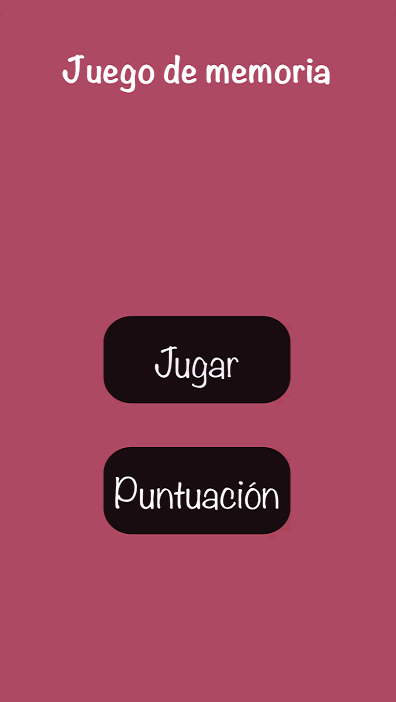
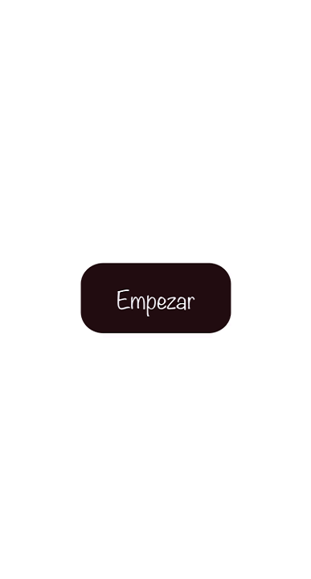
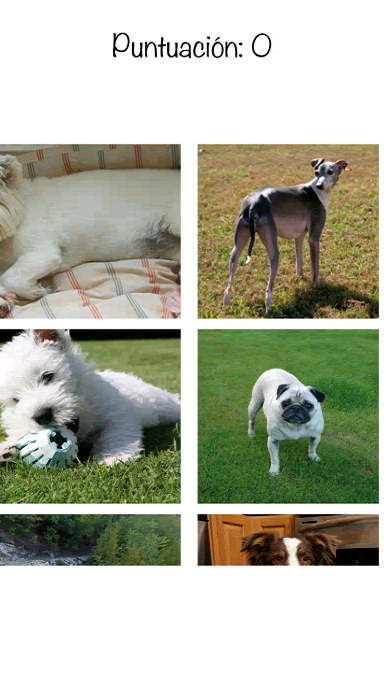

# Juego-Memoria

## Descripción

Esta aplicación desarrollada en Swift tiene como objetivo ayudar a los usuarios a mejorar su memoria visual. Funciona de la siguiente manera:

1. **Entrenamiento de Memoria**: La aplicación muestra una serie de imágenes de forma secuencial para que el usuario las memorice.
   
3. **Prueba de Memoria**: Después del entrenamiento, se presenta al usuario una lista de imágenes dispuestas de forma aleatoria. El usuario debe seleccionar las imágenes que corresponden a las que se mostraron durante el entrenamiento.

## Tecnologías Utilizadas

- Swift: Lenguaje de programación principal.
- UIKit: Para la creación de la interfaz de usuario.
- API: https://dog.ceo/api/breeds/image/random

## Capturas de Pantalla

### Pantalla de inicio:

### Secuencia de imagenes
Le das a empezar y se inicia la secuencia

### Prueba de memoria:
Tienes que seleccionar las imagenes que salieron en la secuencia

## Instalación
1. Clona o descarga el repositorio desde [GitHub](https://github.com/manulis/Juego-Memoria).
2. Abre el proyecto en Xcode.
3. Ejecuta la aplicación en tu dispositivo o simulador.

